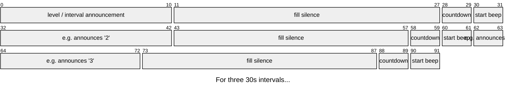

# Beeper

Makes audio files for beep tests.

Beep tests are where you run (or swim, or whatever) laps or lengths
according to some predefined schedule. The schedule intervals typically
get shorter over time until eventually people drop out and are unable
to complete the interval.

Yeah they really suck; but at least it's not boring, like standing there
with a stopwatch and counting up 30s at a time.

**This tool aims to automate 
generation of the beep sequence so you can drop the stopwatch and join in!**

## Example
In the format used here, there's multiple laps at the same "level" i.e.
same duration.

Here's an example CSV input*:
```csv
level,length,start,recovery,clock time
1,1,0:00,00:30.0,0,
,2,0:30,00:30.0,30,
,3,1:00,00:30.0,0,
,4,1:30,00:30.0,30,
2,5,1:58,00:28.0,58,
,6,2:26,00:28.0,26,
```

> _spot the bug in the sample that I was given?_
> 
> 4 x 30s is 2:00 dead, but this sheet has 1:58?!
>
> We use the sum of durations rather than the start/clock time. Cheers Euler.

## Usage

cli args:

* do_voice_demo / `bool` / enumerates voices available to `pyttsx3`
* play_track / `bool` / plays the end result (and a demo, if combined)
* input_filepath / `Path` / an input CSV
* version_name / `str` / the output name, used for filename and audio 'fingerprint'

```shell
beeper no yes "input_file.csv" "output version 1"
```

## Design
I thought accuracy would be important for this kind of nonsense so we try to ensure that
every interval is precise, by eliminating drift from accumulated errors.

That means starting the beep on the dot, everything else being relative to that. We track
our alignment and modify the silence/gaps as needed to ensure we're accurate to within one audio frame.

The sequence is presently:

- some announcement about the interval and maybe the level
- wait for current interval
- countdown beeps
- start beep




## Dependencies

You'll need ffmpeg installed:

https://github.com/jiaaro/pydub#getting-ffmpeg-set-up

* "pydub~=0.25" excellent audio api for building & manipulating the audio: https://github.com/jiaaro/pydub 
* "pyttsx3~=2.98" offline text-to-speech for announcements: https://github.com/nateshmbhat/pyttsx3
* "pyaudio~=0.2" used with `pydub` for reliable playback: https://pypi.org/project/PyAudio/
